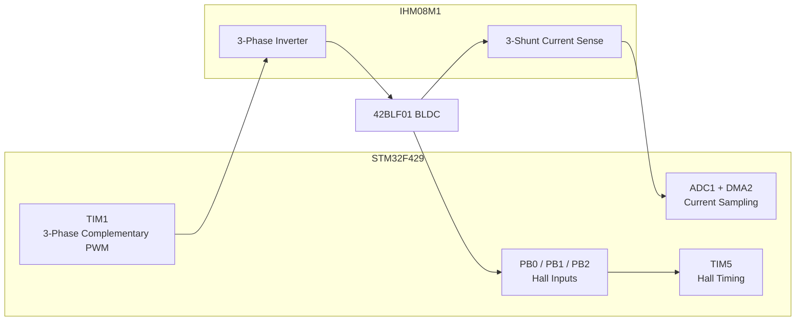
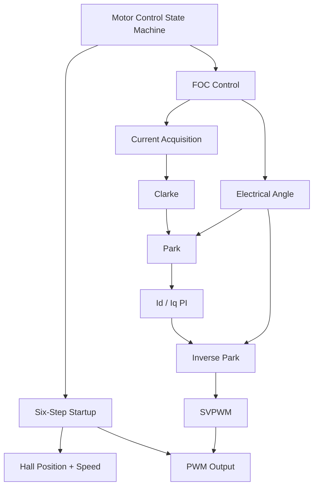
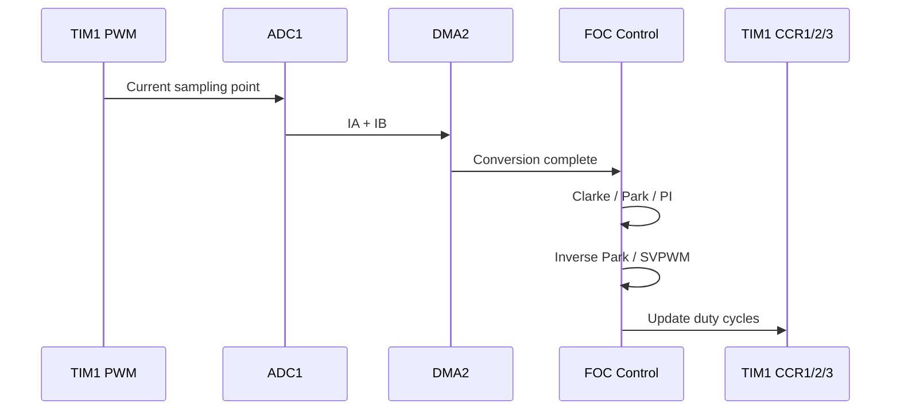
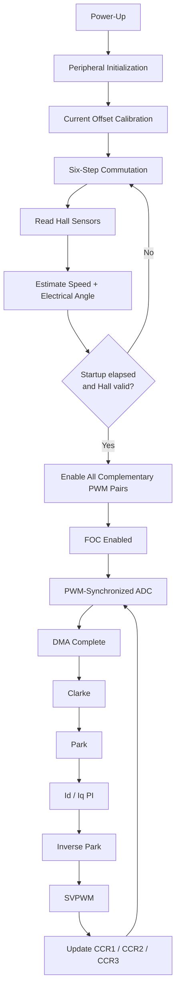

# ⚡ Bare-Metal STM32 FOC BLDC Motor Controller

<p align="center">
  <b>Bare-metal BLDC motor control on STM32F429</b><br>
  Hall six-step startup → current sensing → Hall-based FOC → SVPWM
</p>

<p align="center">
  
  
  
  
  
</p>

## 🚀 Overview

This project implements a from-scratch bare-metal BLDC motor control system on an STM32F429 Discovery board with the X-NUCLEO-IHM08M1 three-phase inverter board.

The first milestone validated Hall-sensor-based six-step commutation and successfully spun the 42BLF01 BLDC motor using direct register-level programming. The next development phase focuses on building a professional field-oriented control architecture, starting with a Hall-based electrical angle subsystem before moving toward current control, Clarke/Park transformations, SVPWM, and later observer-based rotor-flux estimation.

The project is developed in C using VS Code and PlatformIO, without STM32 HAL, STM32 Motor Control SDK, or third-party motor-control libraries.
## 🧭 Development Workflow

This project follows a professional embedded development workflow inspired by the **V-model**, where requirements and design are defined before implementation, and each development layer has a matching verification activity. The goal is to keep the firmware traceable from system requirements down to low-level drivers and back up through testing.

The first diagram shows the practical workflow used in this project, from requirements and prototype validation toward custom PCB preparation.


The second diagram shows the general V-model principle used to connect design phases with their corresponding verification phases.


This project follows the firmware-development workflow:


The implementation is developed bottom-up:

```text
PWM
→ Hall sensing
→ six-step commutation
→ current sensing
→ electrical-angle estimation
→ Clarke / Park
→ current PI
→ inverse Park
→ SVPWM
→ closed-loop FOC
```

Each block is validated before the next block is trusted.

---

## 1. Requirements

The controller shall:

- Drive a three-phase BLDC motor using bare-metal STM32 firmware
- Generate complementary three-phase PWM with dead time
- Read three Hall sensors for rotor-position information
- Measure two motor phase currents and reconstruct the third
- Perform Clarke and Park transformations
- Regulate `Id` and `Iq`
- Perform inverse Park transformation
- Generate three-phase PWM using SVPWM
- Synchronize current acquisition with PWM
- Start reliably using Hall-based six-step commutation
- Transfer from six-step control to FOC only after valid Hall and speed information is available
- Keep the complete control path observable in the debugger

---

## 2. Technical Specifications

### Controller

| Item | Configuration |
|---|---|
| MCU | STM32F429 Discovery |
| Core | ARM Cortex-M4F |
| Language | C |
| Firmware | Bare-metal |
| Register access | Direct CMSIS / register programming |
| IDE | VS Code |
| Build system | PlatformIO |
| PWM timer | TIM1 |
| Hall timing | TIM5 |
| Current ADC | ADC1 |
| Current DMA | DMA2 |

### Power Stage

**ST X-NUCLEO-IHM08M1**

- Three-phase inverter
- Complementary high-side / low-side PWM
- Dead-time control
- 3-shunt current sensing
- Active-low low-side inputs

### Motor

**ACT Motor 42BLF01**

| Parameter | Value |
|---|---:|
| Motor type | NEMA17 BLDC |
| Phases | 3 |
| Poles | 8 |
| Pole pairs | 4 |
| Rated voltage | 24 VDC |
| Rated speed | 4000 rpm |
| No-load speed | 5000 rpm |
| Rated current | 1.9 A |
| Peak current | 5.7 A |
| Rated torque | 0.063 N·m |
| Peak torque | 0.18 N·m |
| Torque constant | 0.035 N·m/A |
| Back-EMF constant | 3.7 V/krpm |
| Phase-to-phase resistance | 2.0 Ω ±10% |
| Rotor inertia | 24 g·cm² |

### Motor Wiring

```text
Phase U = Yellow
Phase V = Green
Phase W = Blue

Hall U  = Yellow
Hall V  = Green
Hall W  = Blue
Hall +5V = Red
Hall GND = Black
```

---

## 3. Hardware Design



### PWM Pin Assignment

```text
Phase U
PE9  → TIM1_CH1
PE8  → TIM1_CH1N

Phase V
PE11 → TIM1_CH2
PE10 → TIM1_CH2N

Phase W
PE13 → TIM1_CH3
PE12 → TIM1_CH3N
```

### Hall Inputs

```text
PB0 → Hall U
PB1 → Hall V
PB2 → Hall W
```

Observed forward Hall sequence:

```text
5 → 4 → 6 → 2 → 3 → 1 → 5
```

### Current Sensing

```text
PC0 → ADC1_IN10 → Phase A current
PC1 → ADC1_IN11 → Phase B current
```

```c
voltA = (3.0f * (float)DMABuffer[0]) / 4095.0f;
voltB = (3.0f * (float)DMABuffer[1]) / 4095.0f;

currA = (voltA - offsetVoltA) / (0.01f * 5.18f);
currB = (voltB - offsetVoltB) / (0.01f * 5.18f);
currC = -(currA + currB);
```

---

## 4. Firmware Architecture

The current bring-up firmware intentionally remains in **one `main.c` file** so register configuration, timing, breakpoints, six-step behavior, and FOC behavior can be inspected directly during validation.



---

## 5. Firmware Design

### Six-Step Startup

The six-step implementation is the known-good startup reference.

| Hall | Commutation |
|---:|---|
| 4 | U+ / V- |
| 5 | U+ / W- |
| 1 | W+ / V- |
| 3 | V+ / U- |
| 2 | V+ / W- |
| 6 | W+ / U- |

Current development startup sequence:

```text
10 s six-step
→ validate Hall / speed
→ transfer to FOC
```

The 10-second delay is only a debugging aid.

### Hall Electrical Angle

Each Hall transition represents one **60° electrical sector**.

The Hall-derived angle already represents electrical position, so the 4 pole pairs are **not multiplied again**.

```text
Hall sector base angle
+
interpolation within the sector
=
continuous electrical angle
```

### Clarke Transform

```c
Ialpha = Ia;
Ibeta  = (Ia + 2.0f * Ib) / sqrtf(3.0f);
```

```c
Ic = -(Ia + Ib);
```

### Park Transform

```c
Id = Ialpha * cos(theta) + Ibeta * sin(theta);
Iq = -Ialpha * sin(theta) + Ibeta * cos(theta);
```

Initial current references:

```c
Id_ref = 0.0f;
Iq_ref = small positive test current;
```

### Current Control

The d-axis and q-axis PI controllers generate:

```text
Vd
Vq
```

Target execution:

```text
PWM frequency          = 20 kHz
Current-loop frequency = 20 kHz
Control period         = 50 µs
```

### Inverse Park

```c
Valpha = Vd * cos(theta) - Vq * sin(theta);
Vbeta  = Vd * sin(theta) + Vq * cos(theta);
```

### SVPWM

```text
Valpha / Vbeta
→ determine SVPWM sector
→ calculate phase on-times
→ CCR1 / CCR2 / CCR3
```

> **Hall sector and SVPWM sector are different.**  
> Hall sector represents rotor electrical position. SVPWM sector represents the commanded stator-voltage vector.

### PWM-Synchronized Current Sampling



---

## 6. Program Flow



---

## 7. Implementation Status

| Block | Status |
|---|---|
| GPIO / clocks | ✅ Complete |
| TIM1 complementary PWM | ✅ Complete |
| Dead time / polarity | ✅ Complete |
| Hall inputs | ✅ Complete |
| Hall sequence validation | ✅ Complete |
| Hall six-step commutation | ✅ Stable |
| TIM5 Hall timing | ✅ Complete |
| Speed estimation | ✅ Complete |
| Electrical-angle interpolation | ✅ Implemented |
| ADC phase-current acquisition | ✅ Complete |
| DMA | ✅ Complete |
| Current-offset calibration | ✅ Complete |
| Clarke transform | ✅ Complete |
| Park transform | ✅ Complete |
| d/q PI structure | ✅ Complete |
| Inverse Park | ✅ Complete |
| SVPWM | ✅ Complete |
| PWM-synchronized sampling | ✅ Implemented |
| Six-step → FOC transfer | 🧪 Under validation |
| 20 kHz FOC execution | 🧪 Under validation |
| Electrical-angle alignment | 🧪 Under validation |
| Stable closed-loop FOC rotation | ⏳ In progress |
| Final PI tuning | ⏳ Pending |
| Protection / fault handling | ⏳ Pending |

---

## 8. Testing and Validation

The project follows a simple rule:

```text
Implement one block
→ measure it
→ validate it
→ change only what failed
→ retest
```

### Block Testing

```text
Hall sensing
Current acquisition
Current offset
Clarke
Park
PI
Inverse Park
SVPWM
```

### Integration Testing

```text
Hall + speed
Hall + electrical angle
ADC + DMA
Current sensing + Clarke / Park
Angle + inverse Park + SVPWM
FOC + PWM
```

### System Testing

```text
Six-step startup
→ FOC takeover
→ stable shaft rotation
→ current tracking
→ load response
```

### Performance Testing

At 20 kHz PWM:

```text
PWM period = 50 µs
```

The complete FOC current loop must execute inside this available control period.

Execution-time profiling is currently one of the main validation tasks.

---

## 9. Hardware Setup

<p align="center">
  <b>Hardware setup image</b><br><br>
  <!-- Replace with your actual image -->
  <code>docs/images/hardware-setup.jpg</code>
</p>

```markdown

```

---

## 10. Current Debugging Plan

```text
1. Verify FOC execution time
2. Verify phase-current signs
3. Verify Hall electrical-angle direction
4. Verify Hall interpolation
5. Test fixed Vd = 0 / fixed Vq without PI
6. Validate electrical-angle offset
7. Validate Id / Iq signs
8. Close current loops
9. Tune PI gains
10. Add final protection and limits
```

Only one block is modified between tests.

---

## 11. Project Structure

During bring-up:

```text
BLDC-FOC/
├── src/
│   └── main.c
├── platformio.ini
└── README.md
```

The one-file implementation is intentional during validation.

It keeps:

- register configuration visible
- breakpoint placement simple
- six-step and FOC comparison direct
- timing measurements traceable
- rollback easy

The firmware can be separated into dedicated modules after the complete control chain is stable.

---

## 12. Roadmap

- [x] Hardware bring-up
- [x] Complementary PWM
- [x] Hall six-step commutation
- [x] Hall speed measurement
- [x] Current sensing + DMA
- [x] Current-offset calibration
- [x] Clarke / Park
- [x] d/q PI implementation
- [x] Inverse Park
- [x] SVPWM
- [ ] Reliable six-step → FOC handover
- [ ] 20 kHz FOC execution optimization
- [ ] Hall electrical-angle alignment
- [ ] Stable closed-loop FOC
- [ ] PI tuning
- [ ] Current / voltage protection
- [ ] Speed control loop
- [ ] Observer-based rotor-flux estimation
- [ ] Dedicated custom motor-controller PCB

---

## Hardware Setup Photo

> **Place your real hardware image here.**

---

## Project Goal

This project does not use a prebuilt motor-control library.

The purpose is to implement and validate the complete motor-control chain from MCU registers to physical motor rotation:

```text
GPIO
→ timers
→ ADC / DMA
→ current reconstruction
→ rotor electrical angle
→ Clarke / Park
→ d/q control
→ inverse Park
→ SVPWM
→ inverter
→ BLDC motor
```

---

<p align="center">
  <b>STM32F429 · Bare-Metal C · BLDC · Hall Sensors · FOC · SVPWM</b>
</p>


The current prototype is used to validate hardware behavior, peripheral configuration, timing, safety logic, and control algorithms before migrating the design toward a dedicated custom BLDC motor-controller PCB.
